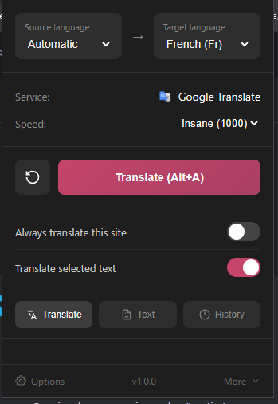

<p align="center">
  
</p>

<h1 align="center">Verbal</h1>

<p align="center">
  <strong>Blazing fast full-page translation powered by Google Translate</strong>
</p>

<p align="center">
  <!-- Add your extension screenshot here -->
  
</p>

---

## About This Project

This project was created to demonstrate how to use Google Translate's unofficial API for free, without needing an API key. It showcases how to reverse-engineer and interact with Google's translation service.

### The Discovery

Google Translate has a hidden endpoint that powers their web interface. By analyzing network requests, we discovered that `translate.googleapis.com` accepts direct translation requests. The trick is formatting the request correctly and parsing the response.

### How We Did It

The Deno server acts as a proxy that:

1. **Formats requests** to match what Google expects
2. **Streams responses** using Server-Sent Events (SSE) for real-time translation
3. **Exposes an OpenAI-compatible API** (`/v1/chat/completions`) making it easy to integrate

The key endpoint:
```
https://translate.googleapis.com/translate_a/single?client=gtx&sl={source}&tl={target}&dt=t&q={text}
```

This is completely free and doesn't require authentication.

---

## What is Verbal?

Verbal is a Chrome extension that translates entire web pages instantly. Fast, clean, and free.

## Features

- **Full Page Translation** - Translates all text on any webpage with one click
- **Turbo Speed** - Lightning-fast translation
- **Alt+A Shortcut** - Quick keyboard shortcut to translate instantly
- **Auto-Translate Sites** - Set specific sites to always translate automatically
- **15+ Languages** - English, Chinese, Japanese, Korean, Spanish, French, German, and more
- **Translation History** - Keep track of your text translations
- **Ad-Blocker Bypass** - Works even with ad blockers enabled
- **Non-Intrusive UI** - Fun hand-drawn style progress indicator

## How It Works

```
┌─────────────┐     ┌─────────────┐     ┌─────────────────┐
│   Chrome    │────▶│ Deno Server │────▶│ Google Translate│
│  Extension  │◀────│  (Proxy)    │◀────│      API        │
└─────────────┘     └─────────────┘     └─────────────────┘
```

1. The **Chrome Extension** collects all text nodes from the page
2. Sends them to the **Deno Server** (local proxy)
3. The server calls **Google Translate** (free, no API key needed)
4. Translated text streams back and is applied to the page in real-time

## Installation

### 1. Start the Server

```bash
cd deno-server
deno run --allow-net --allow-env main.ts
```

Server runs on `http://127.0.0.1:8088`

### 2. Install the Extension

1. Open Chrome and go to `chrome://extensions`
2. Enable "Developer mode" (top right)
3. Click "Load unpacked"
4. Select the `extension` folder

### 3. Use It!

- Click the extension icon and hit **Translate**
- Or press **Alt+A** on any page

## Configuration

| Setting | Description |
|---------|-------------|
| Target Language | Language to translate to |
| Speed Mode | Fast, Turbo, or Insane |
| Auto-Translate | Enable for specific sites |

## Project Structure

```
├── deno-server/          # Translation proxy server
│   ├── main.ts           # Deno Oak server
│   ├── deno.json         # Deno config
│   └── .env              # Environment variables
│
└── extension/            # Chrome extension
    ├── manifest.json     # Extension manifest
    ├── popup.html/js     # Popup UI
    ├── content.js/css    # Page injection
    ├── background.js     # Service worker
    └── icons/            # Extension icons
```

## License

MIT License - feel free to use and modify!

---

<p align="center">
  Made with ❤️ by Kira
</p>
